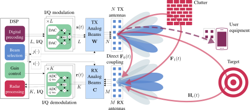

# CISSIR


[][sionna]
[![dependency - cvxpy](https://img.shields.io/badge/cvxpy-1.5.2-blue.svg?logo=data:image/svg+xml;base64,PD94bWwgdmVyc2lvbj0iMS4wIiBlbmNvZGluZz0iVVRGLTgiIHN0YW5kYWxvbmU9Im5vIj8+CjwhLS0gQ3JlYXRlZCB3aXRoIElua3NjYXBlIChodHRwOi8vd3d3Lmlua3NjYXBlLm9yZy8pIC0tPgoKPHN2ZwogICB3aWR0aD0iNzkzLjI5OTMyIgogICBoZWlnaHQ9Ijc1Ny42ODcyNiIKICAgaWQ9InN2ZzIiCiAgIHZlcnNpb249IjEuMSIKICAgaW5rc2NhcGU6dmVyc2lvbj0iMS4zLjIgKDA5MWUyMGUsIDIwMjMtMTEtMjUsIGN1c3RvbSkiCiAgIHNvZGlwb2RpOmRvY25hbWU9ImNvbnZleC5zdmciCiAgIHhtbG5zOmlua3NjYXBlPSJodHRwOi8vd3d3Lmlua3NjYXBlLm9yZy9uYW1lc3BhY2VzL2lua3NjYXBlIgogICB4bWxuczpzb2RpcG9kaT0iaHR0cDovL3NvZGlwb2RpLnNvdXJjZWZvcmdlLm5ldC9EVEQvc29kaXBvZGktMC5kdGQiCiAgIHhtbG5zPSJodHRwOi8vd3d3LnczLm9yZy8yMDAwL3N2ZyIKICAgeG1sbnM6c3ZnPSJodHRwOi8vd3d3LnczLm9yZy8yMDAwL3N2ZyIKICAgeG1sbnM6cmRmPSJodHRwOi8vd3d3LnczLm9yZy8xOTk5LzAyLzIyLXJkZi1zeW50YXgtbnMjIgogICB4bWxuczpjYz0iaHR0cDovL2NyZWF0aXZlY29tbW9ucy5vcmcvbnMjIgogICB4bWxuczpkYz0iaHR0cDovL3B1cmwub3JnL2RjL2VsZW1lbnRzLzEuMS8iPgogIDxkZWZzCiAgICAgaWQ9ImRlZnM0IiAvPgogIDxzb2RpcG9kaTpuYW1lZHZpZXcKICAgICBpZD0iYmFzZSIKICAgICBwYWdlY29sb3I9IiNmZmZmZmYiCiAgICAgYm9yZGVyY29sb3I9IiM2NjY2NjYiCiAgICAgYm9yZGVyb3BhY2l0eT0iMS4wIgogICAgIGlua3NjYXBlOnBhZ2VvcGFjaXR5PSIwLjAiCiAgICAgaW5rc2NhcGU6cGFnZXNoYWRvdz0iMiIKICAgICBpbmtzY2FwZTp6b29tPSIwLjUiCiAgICAgaW5rc2NhcGU6Y3g9IjMyMCIKICAgICBpbmtzY2FwZTpjeT0iNDYxIgogICAgIGlua3NjYXBlOmRvY3VtZW50LXVuaXRzPSJweCIKICAgICBpbmtzY2FwZTpjdXJyZW50LWxheWVyPSJsYXllcjEiCiAgICAgc2hvd2dyaWQ9ImZhbHNlIgogICAgIGlua3NjYXBlOndpbmRvdy13aWR0aD0iMzQ0MCIKICAgICBpbmtzY2FwZTp3aW5kb3ctaGVpZ2h0PSIxMzYxIgogICAgIGlua3NjYXBlOndpbmRvdy14PSIxMTkxIgogICAgIGlua3NjYXBlOndpbmRvdy15PSIxNjMiCiAgICAgaW5rc2NhcGU6d2luZG93LW1heGltaXplZD0iMSIKICAgICBmaXQtbWFyZ2luLXRvcD0iMCIKICAgICBmaXQtbWFyZ2luLWxlZnQ9IjAiCiAgICAgZml0LW1hcmdpbi1yaWdodD0iMCIKICAgICBmaXQtbWFyZ2luLWJvdHRvbT0iMCIKICAgICBpbmtzY2FwZTpzaG93cGFnZXNoYWRvdz0iMiIKICAgICBpbmtzY2FwZTpwYWdlY2hlY2tlcmJvYXJkPSIwIgogICAgIGlua3NjYXBlOmRlc2tjb2xvcj0iI2QxZDFkMSIgLz4KICA8bWV0YWRhdGEKICAgICBpZD0ibWV0YWRhdGE3Ij4KICAgIDxyZGY6UkRGPgogICAgICA8Y2M6V29yawogICAgICAgICByZGY6YWJvdXQ9IiI+CiAgICAgICAgPGRjOmZvcm1hdD5pbWFnZS9zdmcreG1sPC9kYzpmb3JtYXQ+CiAgICAgICAgPGRjOnR5cGUKICAgICAgICAgICByZGY6cmVzb3VyY2U9Imh0dHA6Ly9wdXJsLm9yZy9kYy9kY21pdHlwZS9TdGlsbEltYWdlIiAvPgogICAgICAgIDxkYzp0aXRsZSAvPgogICAgICA8L2NjOldvcms+CiAgICA8L3JkZjpSREY+CiAgPC9tZXRhZGF0YT4KICA8ZwogICAgIGlua3NjYXBlOmxhYmVsPSJMYXllciAxIgogICAgIGlua3NjYXBlOmdyb3VwbW9kZT0ibGF5ZXIiCiAgICAgaWQ9ImxheWVyMSIKICAgICB0cmFuc2Zvcm09InRyYW5zbGF0ZSgyMS42NTI0NzEsLTMyNS4xMzAxOCkiPgogICAgPHBhdGgKICAgICAgIHNvZGlwb2RpOnR5cGU9ImFyYyIKICAgICAgIHN0eWxlPSJmaWxsOm5vbmU7c3Ryb2tlOm5vbmUiCiAgICAgICBpZD0icGF0aDI5OTMiCiAgICAgICBzb2RpcG9kaTpjeD0iMzU1LjcxNDI5IgogICAgICAgc29kaXBvZGk6Y3k9IjU5OC4wNzY0OCIKICAgICAgIHNvZGlwb2RpOnJ4PSIxNzAiCiAgICAgICBzb2RpcG9kaTpyeT0iMjA1LjcxNDI4IgogICAgICAgZD0ibSA1MjUuNzE0MjksNTk4LjA3NjQ4IGMgMCwxMTMuNjEyODYgLTc2LjExMTU5LDIwNS43MTQyOCAtMTcwLDIwNS43MTQyOCAtOTMuODg4NCwwIC0xNzAsLTkyLjEwMTQyIC0xNzAsLTIwNS43MTQyOCAwLC0wLjcwMDg4IDAuMDAzLC0xLjQwMTc0IDAuMDA5LC0yLjEwMjU4IgogICAgICAgc29kaXBvZGk6c3RhcnQ9IjAiCiAgICAgICBzb2RpcG9kaTplbmQ9IjMuMTUxODEzNyIKICAgICAgIHNvZGlwb2RpOm9wZW49InRydWUiIC8+CiAgICA8cGF0aAogICAgICAgc29kaXBvZGk6dHlwZT0iYXJjIgogICAgICAgc3R5bGU9ImZpbGw6bm9uZTtzdHJva2U6I2ZmZmZmZjtzdHJva2Utd2lkdGg6MjQuNjc1MjEyODY7c3Ryb2tlLWxpbmVjYXA6YnV0dDtzdHJva2UtbGluZWpvaW46bWl0ZXI7c3Ryb2tlLW1pdGVybGltaXQ6NDtzdHJva2Utb3BhY2l0eToxO3N0cm9rZS1kYXNoYXJyYXk6bm9uZTtmaWxsLW9wYWNpdHk6MSIKICAgICAgIGlkPSJwYXRoMzc2NSIKICAgICAgIHNvZGlwb2RpOmN4PSIyNjQuNSIKICAgICAgIHNvZGlwb2RpOmN5PSI3MzEuODYyMTgiCiAgICAgICBzb2RpcG9kaTpyeD0iOTIuNSIKICAgICAgIHNvZGlwb2RpOnJ5PSIxNjAuNSIKICAgICAgIGQ9Ik0gMzU3LDczMS44NjIxOCBBIDkyLjUsMTYwLjUgMCAxIDEgMTcyLjAwNDgzLDczMC4yMjE3MyIKICAgICAgIHNvZGlwb2RpOnN0YXJ0PSIwIgogICAgICAgc29kaXBvZGk6ZW5kPSIzLjE1MTgxMzciCiAgICAgICBzb2RpcG9kaTpvcGVuPSJ0cnVlIgogICAgICAgdHJhbnNmb3JtPSJtYXRyaXgoMy41MTc4MTY4LC0wLjAxMDA0ODQ5LDAuMDEwMDY0NDcsNC41OTg1NjcsLTU2Mi44MzEyLC0zMDcyLjI5NTcpIiAvPgogIDwvZz4KPC9zdmc+Cg==)][cvxpy]
[![CC BY 4.0][cc-by-shield]][cc-by]

[cc-by]: http://creativecommons.org/licenses/by/4.0/
[cc-by-shield]: https://img.shields.io/badge/License-CC%20BY%204.0-lightgrey.svg?logo=creativecommons&logoColor=white

[sionna]: https://nvlabs.github.io/sionna/
[cvxpy]: https://www.cvxpy.org/
[paper]: https://arxiv.org/abs/2502.10371

Software and supplemertary material for **Codebooks with Integral-Split Self-Interference Reduction**
(**CISSIR**, pronounced like "scissor"). Please refer to the associated IEEE Transactions Journal Paper:

[CISSIR: Beam Codebooks with Self-Interference Reduction Guarantees for Integrated Sensing and Communication Beyond 5G][paper]



## Main features

CISSIR extends **5G-NR beam codebooks** with a principled **low self-interference (SI)** design
to enable
[integrated sensing and communication (ISAC)](https://isac.committees.comsoc.org/).
CISSIR's main features include:

- :hammer_and_wrench: High versatility: Suitable for hybrid or analog, phased or tapered beamforming, even under multipath SI.
- :memo: Theoretical performance guarantees for sensing SNR in the face of analog/mixed-signal distortion.
- :zap: Better performance[^1] and faster[^2] than other available codebooks.
- :arrows_counterclockwise: Easily (re)usable and extendable
    -  Entirely written in [Python](https://www.python.org/)
    -  Built on top of popular open-source libraries like [sionna] and [cvxpy].

[^1]: In terms of sensing SNR, in comparison with our baseline [LoneSTAR](https://arxiv.org/abs/2206.11418)
[^2]: Up to 130 times faster than LoneSTAR for tapered beamforming.

## Requirements

Full Python dependencies in the [requirements.txt](cluster/requirements.txt) file, including:

- [Sionna][sionna] >=0.17.0
- [Tensorflow](https://www.tensorflow.org/)
- [CVXPY][cvxpy]
- [Pandas](https://pandas.pydata.org/)
- [Seaborn](https://seaborn.pydata.org/)

### Installation

1. Install the requirements with [conda](https://docs.conda.io/projects/conda/en/stable/commands/install.html)
or [pip](https://pip.pypa.io/en/stable/cli/pip_install/). We recommend using a virtual environment for this.
2. To execute the [notebooks](notebooks), we recommend adding the project root to the `PYTHONPATH` so that the
[cissir](cissir) module is accessible everywhere. You can simply create an ad-hoc ipykernel with the proper
`PYTHONPATH` by running the following in the project root:
* In Unix:
```shell
python -m ipykernel install --sys-prefix --name cissir --display-name "CISSIR (python 3)" --env PYTHONPATH "${PYTHONPATH}:${PWD}"
```     
* In [Git Bash](https://gitforwindows.org/) for Windows:
```shell
python -m ipykernel install --sys-prefix --name cissir --display-name "CISSIR (python 3)" --env PYTHONPATH "${PYTHONPATH};$(pwd -W)"
```     

Afterwards, you can just execute `jupyter lab` and run the notebooks with the "CISSIR" kernel.

## Structure

- [cissir](cissir) - Local Python modules.
- [rt](rt) - [Blender](https://www.blender.org/) scene files for
[Sionna's Ray Tracer](https://nvlabs.github.io/sionna/api/rt.html). 
  - Developed with the help of
  [Danial Dehghani](https://www.linkedin.com/in/danial-dehghani/).
- [cluster](cluster) - Requirements, scripts and
[Apptainer](https://apptainer.org/) recipe for (optional)
execution on an [HPC GPU Cluster](https://www.nvidia.com/en-us/glossary/high-performance-computing/).
- [notebooks](notebooks) - [Jupyter](https://jupyter.org/) notebooks demonstrating the code.
- [results](results) - Channel and performance results are stored here.
- [plots](plots) - Generated graphs are stored here.

## Usage

The code can be directly used through [Jupyter notebooks](notebooks).
The following order is recommended:

0. Adjust the simulation parameters in [cissir/params.py](cissir/params.py).
1. Simulate the channel in [simulation/channel.ipynb](notebooks/simulation/channel.ipynb).
2. Run any of the following [optimization notebooks](notebooks/simulation):
   1. [tapered_cissir.ipynb](notebooks/optimization/tapered_cissir.ipynb)
   2. [phased_cissir.ipynb](notebooks/optimization/phased_cissir.ipynb)
   3. [lonestar.ipynb](notebooks/optimization/lonestar.ipynb)
3. Run the simulations:
   1. [snr_sensing.ipynb](notebooks/simulation/snr_sensing.ipynb).
   2. [si_codebook_comm.ipynb](notebooks/simulation/si_codebook_comm.ipynb).
4. Analyze and plot the results with the [analysis notebooks](notebooks/analysis):
   1. [link_level.ipynb](notebooks/analysis/link_level.ipynb)
   2. [trade_off.ipynb](notebooks/analysis/trade_off.ipynb)
   3. [time_complexity.ipynb](notebooks/analysis/time_complexity.ipynb)
   4. [feasibility.ipynb](notebooks/analysis/feasibility.ipynb)
  
## Acknowledgment

The authors of this work acknowledge the financial support by the
[Federal Ministry for Research, Technology and Space (BMFTR)](https://www.bmftr.bund.de/EN/)
in the programme [“Souverän. Digital. Vernetzt.”](https://www.bmftr.bund.de/SharedDocs/Publikationen/DE/5/31677_Souveraen_Digital_Vernetzt.html)
Joint project [6G-RIC](https://6g-ric.de) (grant numbers: 16KISK020K, 16KISK030).
[Rodrigo Hernangómez](https://github.com/rodrihgh)
acknowledges BMBF support in the project [KOMSENS-6G](https://www.komsens-6g.com/) (grant number: 16KISK121).

_The CISSIR logo has been designed by [Risto Avramovski](https://ristoavramovski.com/)._

## Citation

If you use this software or the results of [our work][paper], please cite it as:

```bibtex
@article{hernangomez2025cissir,
  title = {{{CISSIR}}: {{Beam Codebooks}} with {{Self-Interference Reduction Guarantees}} for {{Integrated Sensing}} and {{Communication Beyond 5G}}},
  author = {Hernang{\'o}mez, Rodrigo and Fink, Jochen and Cavalcante, Renato L. G. and Sta{\'n}czak, S{\l}awomir},
  year = {2025},
  journal = {IEEE Transactions on Wireless Communications},
  online = {https://arxiv.org/abs/2502.10371},
  doi = {10.48550/arXiv.2502.10371},
}
```
   
---
