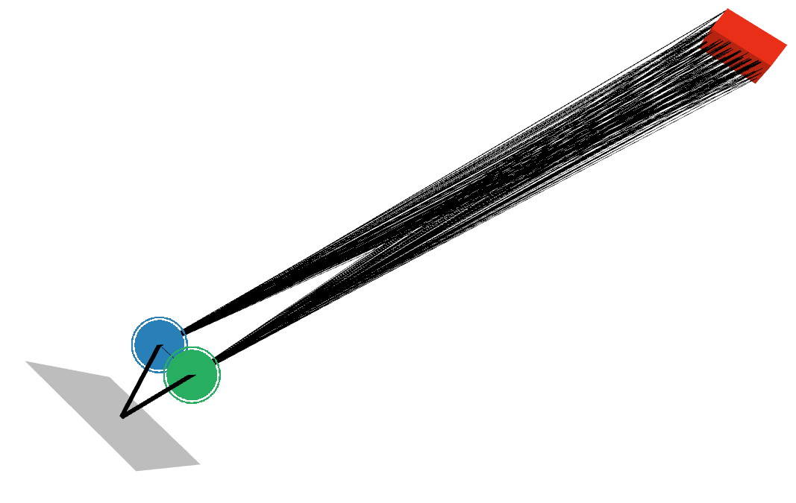

# Ray-Tracing

The ray-tracing simulations are based on [Sionna](https://nvlabs.github.io/sionna/api/rt.html)
and they have been developed with the help of
[Danial Dehghani](https://www.linkedin.com/in/danial-dehghani/).

